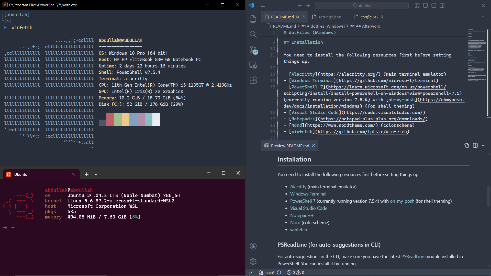

# dotfiles (Windows)

Personal Windows dotfiles and configuration (tested on Windows 10 22H2).

## Screenshot



## Installation

You need to install the following resources first before setting things up.

- [Alacritty](https://alacritty.org/) (main terminal emulator)
- [Windows Terminal](https://github.com/microsoft/terminal)
- [PowerShell 7](https://learn.microsoft.com/en-us/powershell/scripting/install/install-powershell-on-windows?view=powershell-7.5) (currently running version 7.5.4) with [oh-my-posh](https://ohmyposh.dev/docs/installation/windows) (for shell theming)
- [Visual Studio Code](https://code.visualstudio.com/) (or you can use [Cursor](https://cursor.com/) / [Antigravity](https://antigravity.google/) or any fork basically)
- [Notepad++](https://notepad-plus-plus.org/downloads/)
- [Nord](https://www.nordtheme.com/) (colorscheme)
- [winfetch](https://github.com/lptstr/winfetch)
- [Cascadia Mono Nerd Font (NF)](https://github.com/microsoft/cascadia-code) (you need this for icon rendering in terminal)

### PSReadLine (for auto-suggestions in CLI)

For auto-suggestions in the CLI, make sure you have the latest [PSReadLine](https://github.com/PowerShell/PSReadLine) module installed in PowerShell. You can install it by running.

```pwsh
# See installed versions
Get-Module -Name PSReadLine -ListAvailable | Select-Object Name, Version, Path

# See if a new version is available
Find-Module PSReadLine

# Install the latest version
Update-Module PSReadLine

# Use this if the above gives an error
# Install-Module PSReadLine -Force -AllowClobber -Scope CurrentUser
```

Restart PowerShell and you should see auto-suggestions in the command line.

### WSL on Ubuntu 24.04 LTS

- [zsh](https://github.com/ohmyzsh/ohmyzsh/wiki/Installing-ZSH) (shell) with [oh-my-zsh](https://ohmyz.sh/) (for shell theming)
- [fastfetch](https://github.com/fastfetch-cli/fastfetch)
- [micro](https://micro-editor.github.io/) (CLI text editor)

### Some `zsh` plugins I like

I use the `zsh-autosuggestions` and `zsh-syntax-highlighting` plugins for auto-suggestions in my command line. Refer to this [gist](https://gist.github.com/n1snt/454b879b8f0b7995740ae04c5fb5b7df) for installation instructions.

## Afterword

These files reflect my personal Windows development setup; feel free to fork or adapt them to your workflow.
