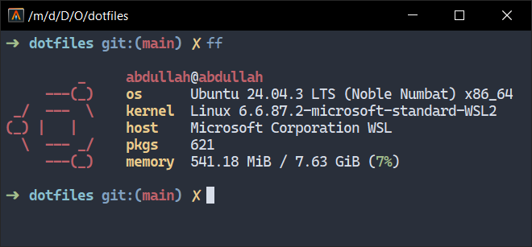

# Setting up fish on WSL

## Screenshot



## Setup

Install by running the following command on WSL.

```bash
sudo apt install fish
```

Change your default shell to fish.

```bash
echo $(which fish)  # Should return something like /usr/bin/fish
chsh -s /usr/bin/fish
```

Restart the terminal (or logout) to see the changes.

### Using a plugin manager

A plugin manager allows you to install fish tools like `z` for fuzzy directory navigation etc.

I use [fisher](https://github.com/jorgebucaran/fisher). Install it by running this command.

```bash
curl -sL https://raw.githubusercontent.com/jorgebucaran/fisher/main/functions/fisher.fish | source && fisher install jorgebucaran/fisher
```

To install a plugin simply run.

```bash
fisher install <plugin-name>
```

### Some plugins I use

- [jethrokuan/z](https://github.com/jethrokuan/z)
- [acomagu/fish-async-prompt](https://github.com/acomagu/fish-async-prompt)

### Shell prompt

I use oh-my-fish for shell prompt theming. You can install it by running this command.

```bash
curl https://raw.githubusercontent.com/oh-my-fish/oh-my-fish/master/bin/install | fish
```

Here are some themes I use.

- [agnoster](https://github.com/oh-my-fish/theme-agnoster)
- [robbyrussell](https://github.com/oh-my-fish/theme-robbyrussell)

> **Note**: You can install any omf theme / package by running `omf install <theme-name>`

### Some aliases I use

- `c` for `clear`
- `clean` for `sudo apt-get autoremove && sudo apt-get autoclean`
- `ff` for `fastfetch`
- `pwsh` for running Powershell in the same window (I use this for cross platform coding especially for opening VS Code)
- `update` for `sudo apt-get update && sudo apt-get upgrade`
- `add` for `sudo apt-get install`
- `del` for `sudo apt-get remove --purge`

To install, copy the contents of the [functions](./functions/) directory to `~/.config/fish/functions`.
